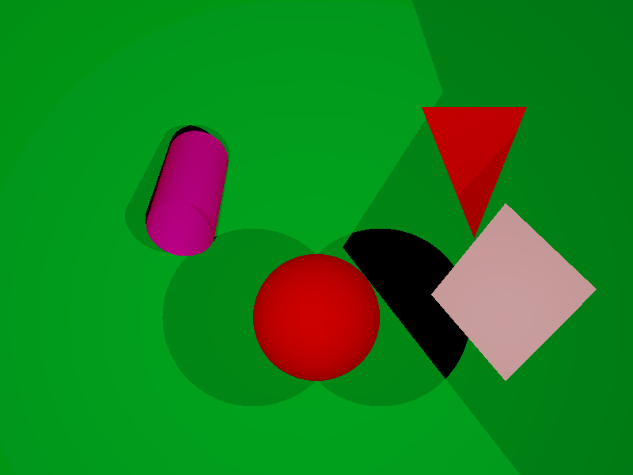

# miniRT

<p align="center">
  
</p>

### Description

Raytracing implementation drawing various figures (plane, triangle, square, cylinder and sphere) on the screen with lightning.
This project was implemented while studying at [42](https://42.fr) (Moscow).

### Task

The task is to implement simple raytracing and draw various figures on the screen, support ambience and global lighting, translation, rotation and shadows, multiple cameras with options to switch between them as well as custom configuration to properly control the scene.

### Configuration structure

This is an example of scene configuration file with the description with every possible option:

```
# Resolution of the window settings: R <width> <height>
R   800        600

# Ambience lighting: A <lighting ratio in [0.0,1.0]> <color: RGB in [0,255] for each channel>
A   0.5        255,0,0

# Camera(s): c <position coordinates: X,Y,Z> <orientation vector: X,Y,Z in [-1,1]> <horizontal FOV (field of view) in [0,180]>
c   0,0,-20     0,0,1     53.3

# Light(s): l <position coordinates: X,Y,Z> <brightness ratio in [0.0,1.0]>
l   5,0,0      1          255,255,255
l   -5,0,0     1          255,255,255

# Sphere(s): sp <sphere center coordinates: X,Y,Z> <diameter> <color>
sp  0,0,30     10         255,0,0

# Plane(s):  pl <plane center coordinates: X,Y,Z> <orientation vector: X,Y,Z> <color>
pl 0,0,100     0,0,-1     0,255,50

# Square(s): sq <square center coordinates: X,Y,Z> <orientation vector: X,Y,Z> <size of the side> <color>
sq 7.5,1,5    0.5,0,0.5   5         255,255,255

# Cylinder(s): cy <cylinder center coordinates: X,Y,Z> <orientation vector: X,Y,Z> <diameter> <height> <color> 
cy -20,20,80  0,1,1       10        20           255,20,255

# Triangle(s): tr  <1-st point coordinates> <2-nd point coordinates> <3-rd point coordinates> <color>
tr 10,10,10   5,10,10     10,5,20   255,20,0  
```

### Dependencies

This project depends on [MLX42](https://github.com/codam-coding-college/MLX42.git) library, which itself depends on [GLFW](https://www.glfw.org/) library. So it is required to have them both installed first.

#### MacOS

##### GLFW

To install glfw on MacOS run:

```bash
brew install glfw
``` 

or use precompiled binaries from the [official website](https://www.glfw.org/download.html).

##### MLX42

The simplest and straightforward way to install MLX42 is to download the repository and compile it. Then it will produce static archive with all necessary functions which is enough along with include folder from the repo, this is the copy of instructions from the [MLX42 repo](https://github.com/codam-coding-college/MLX42?tab=readme-ov-file#for-macos):

```bash
git clone https://github.com/codam-coding-college/MLX42.git
cd MLX42
cmake -B build # build here refers to the outputfolder.
cmake --build build -j4 # or do make -C build -j4
```

### How to build?

- `make` or `make all` - Build the binary.
- `make clean` - Remove object and dependencies (-MMD) files.
- `make fclean` - Run `make clean` as well as remove the main target binary. 
- `make re` - Run `make fclean` and `make all`.

### How to use?

To render the scene:

```bash
./miniRT <scene configuration file>
```

To make a screenshot in BMP:

```bash
./miniRT <scene filepath> --save
```

Screenshot will be saved at the root under `screenshot.bmp`.

To navigate between multiple cameras use left and right arrows.

### References

- [Ray Tracing in one Weekend](https://raytracing.github.io/).

*Thanks to all folks from [42](https://42.fr) Moscow who provided scenes for the project!*